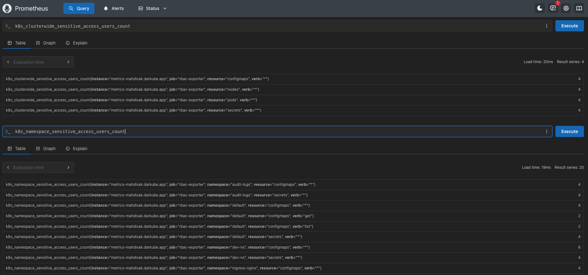

# Environment Variables Documentation

This document lists all environment variables used across the security-task project services.

### Key Environment Variables

**audit-logs:**
- `INPUT_PATH`: Path to principals configuration (default: `../shared/json-files/input.json`)
- `OUTPUT_JSONL_PATH`: Output path for audit reports (default: `../shared/reports.jsonl`)

**sidecar:**
- `ELASTICSEARCH_URL`: Elasticsearch cluster URL
- `ELASTICSEARCH_DATA_PATH`: Path to read audit logs

**rbac-exporter:**
- `ELASTICSEARCH_URL`: Elasticsearch query endpoint
- `LISTEN_ADDR`: HTTP server address for metrics

## Project Structure

```
security-task/
├── audit-logs/          # Audit log microservice
│   ├── main.go
│   ├── access_mapper.go
│   ├── input_loader.go
│   ├── go.mod
│   ├── go.sum
│   └── Dockerfile
├── sidecar/             # Elasticsearch shipper microservice
│   ├── main.go
│   ├── go.mod
│   ├── go.sum
│   └── Dockerfile
├── rbac-exporter/       # Prometheus metrics exporter microservice
│   ├── main.go
│   ├── go.mod
│   ├── go.sum
│   └── Dockerfile
└── shared/              # Shared data volume (emptyDir, mounted at /shared)
    ├── json-files/      # Config and debug output (input.json from ConfigMap)
    │   ├── input.json   # Copied by init container from ConfigMap
    │   └── output-of-the-code.json
    ├── reports.jsonl
    ├── reports-flat.jsonl
    ├── .offset          # Sidecar read offset for nested (reset on pod start)
    └── .offset-flat     # Sidecar read offset for flat (reset on pod start)
```

## Table of Contents
- [Audit Log Service (audit-logs/)](#audit-log-service)
- [Sidecar Service (sidecar/)](#sidecar-service)
- [RBAC Exporter Service (rbac-exporter/)](#rbac-exporter-service)

---

## Audit Log Service

**Binary**: `rbac-audit`  
**Source Directory**: `audit-logs/`  
**Main File**: `audit-logs/main.go`

| Variable | Default Value | Type | Description |
|----------|--------------|------|-------------|
| `INPUT_PATH` | `/shared/json-files/input.json` | string | Path to the input configuration file containing principals (users/groups) to audit. |
| `OUTPUT_JSONL_PATH` | `/shared/reports.jsonl` | string | Path to write nested JSONL audit reports (UserAccessReport format). |
| `OUTPUT_FLAT_JSONL_PATH` | `/shared/reports-flat.jsonl` | string | Path to write flattened JSONL audit reports (FlatPermission format). |
| `DEBUG_OUTPUT_PATH` | `/shared/json-files/output-of-the-code.json` | string | Path to write formatted JSON debug output (pretty-printed). If write fails, it is logged but non-fatal; JSONL outputs still proceed. |

### Notes
- The audit service reads RBAC data from Kubernetes API and maps it to principals from `INPUT_PATH`.
- Output files are appended to on each run (no rotation built-in).
- Shared directory is mounted at `/shared` (emptyDir) with config files and runtime data.
- Init container `copy-input` copies ConfigMap into `/shared/json-files/input.json`.

---

## Sidecar Service

**Binary**: `rbac-sidecar`  
**Source Directory**: `sidecar/`  
**Main File**: `sidecar/main.go`

| Variable | Default Value | Type | Description |
|----------|--------------|------|-------------|
| `ELASTICSEARCH_URL` | `https://mahdixak-security-auditdb.darkube.app/` | string | Elasticsearch cluster URL. |
| `ELASTICSEARCH_INDEX` | `audit-logs` | string | Index name for nested audit reports. |
| `ELASTICSEARCH_FLAT_INDEX` | `audit-logs-flat` | string | Index name for flattened audit reports. |
| `ELASTICSEARCH_DATA_PATH` | `../shared/reports.jsonl` | string | Path to read nested audit reports (must match audit output). |
| `ELASTICSEARCH_FLAT_DATA_PATH` | `../shared/reports-flat.jsonl` | string | Path to read flattened audit reports (must match audit output). |
| `ELASTICSEARCH_OFFSET_PATH` | _(derived from data path)_ | string | File to track read offset for nested reports. Default: same dir as data path, `.offset`. |
| `ELASTICSEARCH_FLAT_OFFSET_PATH` | _(derived from flat data path)_ | string | File to track read offset for flattened reports. Default: same dir, `.offset-flat`. |
| `ES_USERNAME` | _(empty)_ | string | Elasticsearch basic auth username (optional). |
| `ES_PASSWORD` | _(empty)_ | string | Elasticsearch basic auth password (optional). |
| `FLUSH_EVERY` | `10` | int | Number of documents to batch before flushing to Elasticsearch. |
| `POLL_EVERY` | `1s` | duration | Interval to poll the JSONL files for new data. |

### Notes
- Sidecar continuously reads from JSONL files and ships data to Elasticsearch.
- Uses content hash (`sha256`) as document `_id` for idempotency.
- Init container `reset-offset` clears `.offset` and `.offset-flat` on pod start.
- On file truncation/rotation, offset resets to 0.
- Creates indices automatically if they don't exist.
---

## RBAC Exporter Service

**Binary**: `rbac-exporter`  
**Source Directory**: `rbac-exporter/`  
**Main File**: `rbac-exporter/main.go`

| Variable | Default Value | Type | Description |
|----------|--------------|------|-------------|
| `ELASTICSEARCH_URL` | `http://localhost:9200` | string | Elasticsearch cluster URL to query audit data from. |
| `ES_INDEX` | `audit-logs-flat` | string | Index name to query for flat audit reports. |
| `ES_USERNAME` | _(empty)_ | string | Elasticsearch basic auth username (optional). |
| `ES_PASSWORD` | _(empty)_ | string | Elasticsearch basic auth password (optional). |
| `WINDOW` | `24h` | duration | Time window to query audit data (e.g., last 24 hours). |
| `POLL_EVERY` | `30s` | duration | Interval to refresh metrics from Elasticsearch. |
| `MAX_BUCKETS` | `10` | int | Maximum number of buckets for Elasticsearch aggregations (terms size). |
| `LISTEN_ADDR` | `:8080` | string | HTTP server address to expose Prometheus metrics endpoint. |

### Exposed Metrics Endpoint
- **URL**: `http://<host>:8080/metrics`
- **Format**: Prometheus text format

### Notes
- Reads from Elasticsearch only (no direct Kubernetes or file access).
- Computes aggregated metrics and exposes them for Prometheus scraping.
- Metrics are reset on each refresh to avoid stale label sets.

---

## Metrics Exposed by RBAC Exporter

| Metric Name | Type | Labels | Description |
|-------------|------|--------|-------------|
| `rbac_flat_docs_total` | Gauge | - | Total number of flat RBAC documents in the time window. |
| `rbac_users_total` | Gauge | - | Number of distinct users seen in the time window. |
| `rbac_permission_grants_total` | GaugeVec | `namespace`, `resource`, `verb`, `scope` | Count of permission grants by dimensions. |
| `rbac_high_risk_grants_total` | GaugeVec | `namespace`, `resource`, `verb`, `scope` | Count of high-risk permissions (create/update/patch/delete). |
| `k8s_namespace_sensitive_access_users_count` | GaugeVec | `namespace`, `verb`, `resource` | Count of distinct users with access to sensitive resources (secrets, deployments, configmaps) per namespace. |
| `k8s_clusterwide_sensitive_access_users_count` | GaugeVec | `resource`, `verb` | Count of distinct users with cluster-wide access to important resources. |
| `rbac_exporter_scrape_errors_total` | Counter | - | Total number of errors during metric collection. |
| `rbac_exporter_last_success_unixtime` | Gauge | - | Unix timestamp of last successful metrics refresh. |
---



---

